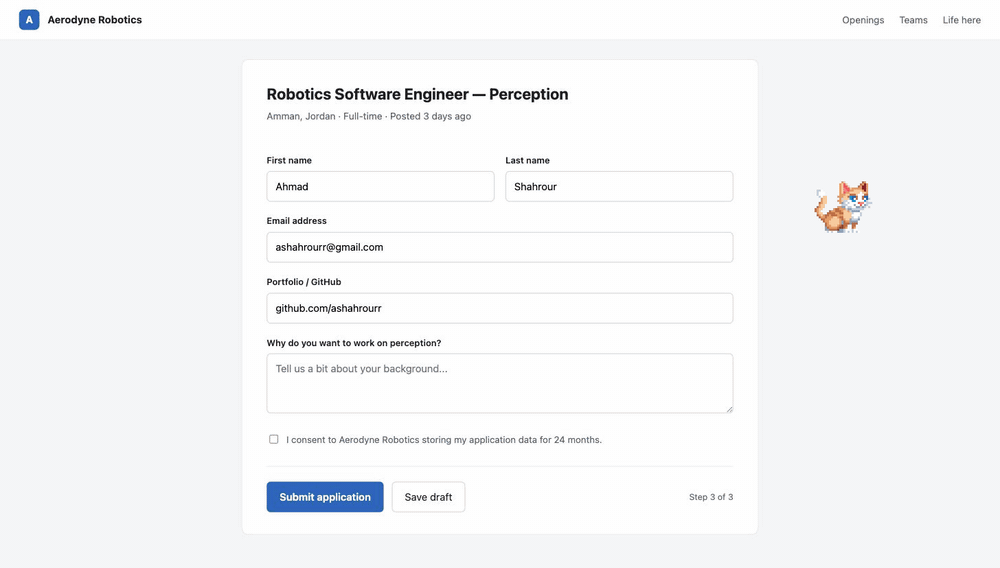

# Website Pet — a browser agent that learns site skills, and shows you what it's doing

> **Built on [browser-use](https://github.com/browser-use/browser-use)** (MIT — Magnus Müller, Nick
> Sweeting, Gregor Žunič and contributors). This repository is a full copy of browser-use with my
> Website Pet layer added on top, because the pet needs changes to browser-use's own click and DOM
> internals and will not run against the released package. Upstream's README is preserved as
> [README.browser-use.md](./README.browser-use.md) and its licence is unchanged.
>
> **My work is the `pet_*` modules, `pet_extension/`, `llm/openclaw/` and their tests** — listed
> precisely under [What I built](#what-i-built).



A browser agent normally works invisibly: the tab twitches, things get clicked, and you find out
what happened afterwards by reading a log. Two problems follow from that. You cannot supervise it,
and it re-derives the same page from scratch on every run.

Website Pet addresses both:

- **A visible companion.** A pixel cat lives on the page and physically walks to each element
  *before* browser-use acts on it. You watch the agent work instead of reconstructing it.
- **Learned site skills.** Successful runs are recorded as traces. A learner turns repeated traces
  into a reusable, validated skill for that site, so the second visit is a replay rather than a
  fresh LLM exploration.

---

## What I built

| Path | Lines | What it does |
|---|---:|---|
| `browser_use/pet.py` | 2,359 | aiohttp bridge on `127.0.0.1:8765`; owns the task lifecycle, agent questions, stop control |
| `browser_use/pet_skill_learner.py` | 453 | turns recorded traces into proposed site skills |
| `browser_use/pet_skill_context.py` | 423 | the browser interaction surface a skill is allowed to touch |
| `browser_use/pet_trace.py` | 423 | per-run operation traces — the training data for skills |
| `browser_use/pet_skills.py` | 280 | skill registry: load, match, execute |
| `browser_use/pet_skill_steps.py` | 277 | declarative step schema + interpreter |
| `browser_use/pet_memory.py` | 249 | per-site memory and reflections |
| `browser_use/pet_extension/` | — | Chrome extension: PixiJS cat, task panel, key trap, background proxy |
| `browser_use/llm/openclaw/` | — | `ChatOpenClaw` provider |
| `tests/ci/test_pet_*.py` | 1,232 | tests for the above |

Plus the changes to browser-use itself that the pet depends on: coordinate clicking, DOM serializer
output, watchdog and tools changes. `git log` credits upstream for everything else.

---

## The ideas worth reading the code for

### 1. A skill is a validated step list, not generated code

The obvious way to make an agent "learn a site" is to have the LLM write a script. That fails in
boring, repetitive ways: invented selector syntax, hardcoded month names, brittle date parsing.

`pet_skill_steps.py` makes those mistakes **unrepresentable**. A skill is a schema-validated list of
steps, and a single interpreter executes every skill through one `SkillContext`. The LLM's job is
reduced to filling in a structure it cannot violate — it never emits executable code.

### 2. Learning is proposal-only

`pet_skill_learner.py` never installs what it learns. It reads recent traces and writes a *candidate*:

```bash
python -m browser_use.pet --propose-skill example.com
```

An agent that silently rewrites its own behaviour after a run it thinks went well is an agent you
cannot trust. A proposal you review is one you can.

### 3. (a smaller one) The pet never drives the page by accident

`pet_extension/key-trap.js` runs at `document_start`, before the page's own scripts, and swallows
keystrokes that originate inside the pet UI. Without it, typing a task into the pet while sitting on
a game or an editor would also drive the page — arrow keys moving 2048 tiles underneath you. It
stops propagation without calling `preventDefault`, so your text still lands in the pet's field.

---

## How it fits together

```text
Chrome tab
  │  pet_extension/  ── cat companion (PixiJS) + task panel (shadow DOM)
  │        │  background.js proxies to the bridge
  ▼        ▼
http://127.0.0.1:8765         browser_use/pet.py   (aiohttp bridge)
  │                                   │
  │  POST /tasks  GET /status         │  matches a learned skill for this site?
  │  POST /reply  POST /stop          │
  │                        ┌──────────┴──────────┐
  │                     yes│                     │no
  │                        ▼                     ▼
  │              pet_skills.py            browser-use Agent
  │              (replay steps)           (LLM explores)
  │                        └──────────┬──────────┘
  │                                   ▼
  │                            pet_trace.py  ── records the run
  │                                   ▼
  └───────────── cat walks to each target before the action fires
                                      ▼
                        pet_skill_learner.py  ── proposes a skill
```

---

## Setup

Requires Python 3.11+ and a Chrome started with remote debugging.

```bash
git clone https://github.com/ashahrourr/skill-learning-browser-agent
cd skill-learning-browser-agent
uv sync                      # or: pip install -e .
```

Start the bridge:

```bash
python -m browser_use.pet
# Website Pet bridge listening on http://127.0.0.1:8765
```

Load the extension: Chrome → `chrome://extensions` → Developer mode → **Load unpacked** →
`browser_use/pet_extension/`.

Then open any page and click the extension icon to deploy the pet to that site. The cat appears;
click it to open the task panel, type what you want, press Run.

```
--host / --port        bridge address (default 127.0.0.1:8765)
--cdp-url              Chrome CDP URL; auto-discovers a debug-enabled Chrome by default
--max-steps            cap agent steps
--log-dir              per-tab logs        (default .pet_logs/)
--site-dir             per-site memory     (default .pet_sites/)
--propose-skill SITE   propose a skill from recent traces instead of serving
```

### Animation check

With the extension loaded, keys `1`–`7` cycle the cat's states: idle, walk, jump, sleep, lick,
click, success. Sleep and lick fall back to idle — the free sprite pack does not include those
sheets.

---

## Verified

The bridge, the extension, the cat and the task panel were run end to end against a local form
before this README was written; the GIF above is that session, not a mock-up. Health check:

```bash
$ curl -s 127.0.0.1:8765/health
{"ok": true}
$ curl -s "127.0.0.1:8765/status?session_id=tab:1"
{"state": "idle", "message": "Ready", "question": null, "task_id": null}
```

Running a full task additionally needs an LLM configured for `ChatOpenClaw`.

---

## Credits

- **browser-use** — MIT, Magnus Müller / Nick Sweeting / Gregor Žunič and contributors.
  See [LICENSE](./LICENSE) and [README.browser-use.md](./README.browser-use.md).
- **Cat sprites** — *Cat 2D Pixel Art* pack by **Mattz Art**. Check the pack's own licence
  terms before redistributing; swap `browser_use/pet_extension/public/assets/cat/` to use different
  sprites.
- **PixiJS** — MIT.
